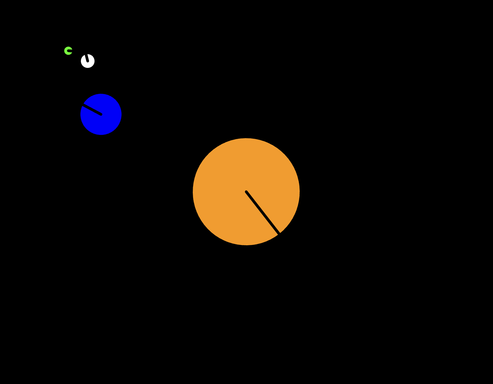

# Solar System

## About

This application is a simple simulation of celestial objects created using the p5.js library. It visualizes the movement and rotation of four objects: the Sun, Earth, Moon, and an Asteroid. Here's a breakdown of its functionality:

Sun (orange): Located at the center of the canvas and rotates slowly.

Earth (blue): Orbits clockwise around the Sun.

Moon (white): Orbits anti-clockwise around the Earth.

Asteroid (green): Orbits clockwise around the Moon.
